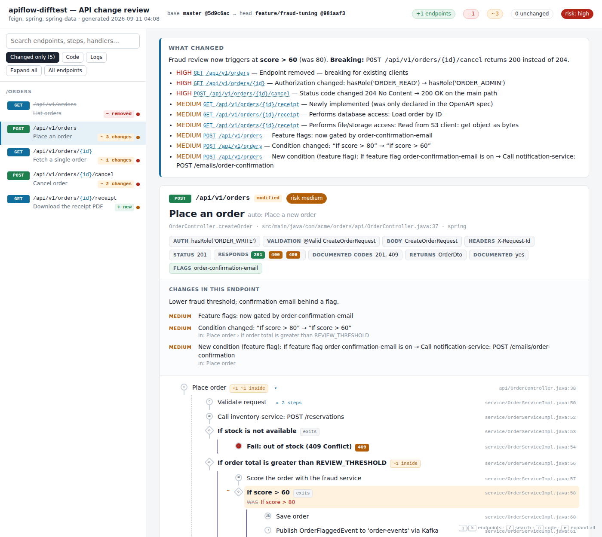

# api-flow-map — Claude skill for API flow maps and PR change reviews

A [Claude skill](https://support.claude.com/en/articles/12512176-what-are-skills) (Agent Skills
open standard) packaged as a Claude Code plugin marketplace. It scans an API repository, writes
every endpoint's request flow in plain English, and diffs a branch against its base with risk
scoring: before/after box diagrams aligned step by step, a whole-PR review page, IDE-style code
changes, a Markdown PR comment with Mermaid diagrams, and a CI gate.

Frameworks: Spring MVC/WebFlux, JAX-RS, Express/Koa/Fastify/Hono, NestJS, Next.js, Flask,
FastAPI, Django REST, Go (net/http, gin, echo, chi, gorilla), ASP.NET Core, OpenAPI, serverless.yml/SAM.
Python 3.9+, git; PyYAML optional. No network access, read-only on the repository.

## What it looks like



More in [`screenshots/`](screenshots/) — whole-PR overview, before/after box
diagrams, the VS Code-style code-changes toggle inline and side by side.
Real generated output is in [`samples/`](samples/): open
`sample-pr-review.html` in a browser, and `sample-pr-comment.md` is exactly
what lands on a pull request.

The original project handoff, kept verbatim, is in [`HANDOFF.md`](HANDOFF.md).

## Install

**Claude Code**

```
/plugin marketplace add Soulful-Iris/api-flow-map
/plugin install api-flow-map@bruno-api-tools
```

**claude.ai / Claude Desktop / Cowork** — upload the `.zip` from the latest release under
Customize > Skills (personal) or Organization settings > Skills (Team/Enterprise owners).

**Claude API** — upload the same archive via the Skills API (`/v1/skills`).

Full publishing and governance steps: [PUBLISHING.md](PUBLISHING.md).

## Use

Once installed, just ask:

- "Review what this branch changes in the API compared to main"
- "Map every endpoint in this repo and explain what each one does"
- "Set up a CI gate that blocks PRs changing auth or status codes"

Or run the tooling directly:

```
S=plugins/api-flow-map/skills/api-flow-map/scripts
python3 $S/apiflow.py doctor <repo>
python3 $S/apiflow.py scan   <repo> -o apiflow-out
python3 $S/apiflow.py diff   <repo> --base origin/main -o apiflow-out --fail-on-risk high
```

## Repository layout

```
.claude-plugin/marketplace.json                  marketplace catalog
plugins/api-flow-map/
  .claude-plugin/plugin.json                     plugin manifest (version = release signal)
  skills/api-flow-map/
    SKILL.md                                     what Claude follows
    scripts/apiflow.py, scripts/apiflow/         scanner, differ, renderers (stdlib only)
    scripts/tests/                               unit + fixture + git-scenario tests
    references/                                  schema, frameworks, CI, config, writing titles
    evals/evals.json                             prompts for the skill-creator test loop
tools/validate.py                                manifests + frontmatter + tests
tools/build_skill_zip.py                         claude.ai upload archive → dist/
.github/workflows/ci.yml, release.yml            validation on PR; release artifacts on tag
CHANGELOG.md · CONTRIBUTING.md · SECURITY.md · PUBLISHING.md · LICENSE
```

## Verify locally

```
python3 tools/validate.py          # manifests, SKILL.md frontmatter, 23 tests
tools/demo.sh                      # builds a demo repo + branch, runs the diff, opens the review
python3 tools/build_skill_zip.py   # dist/api-flow-map-<version>.skill + .zip
claude plugin validate .           # optional, needs the Claude Code CLI
```
