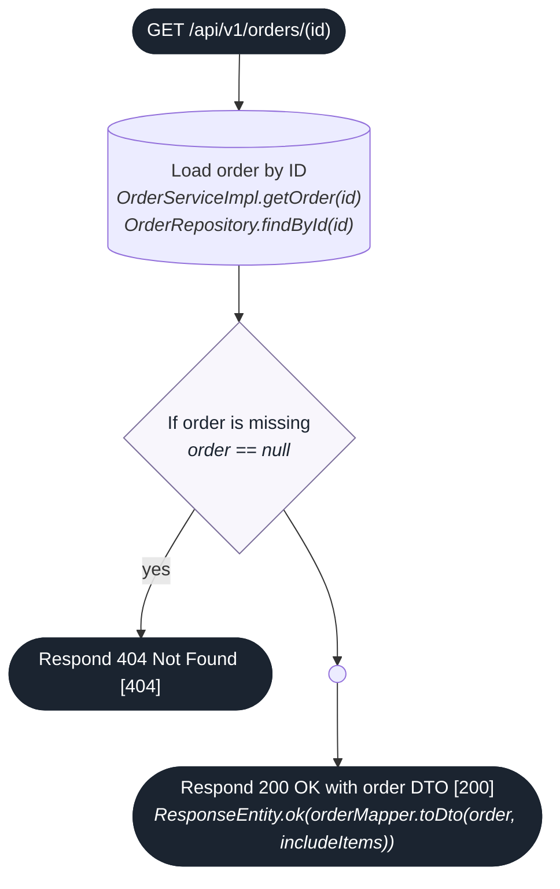
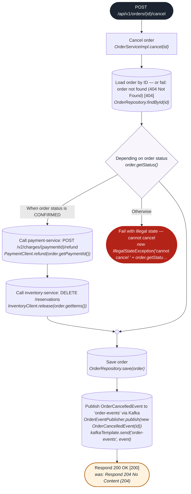
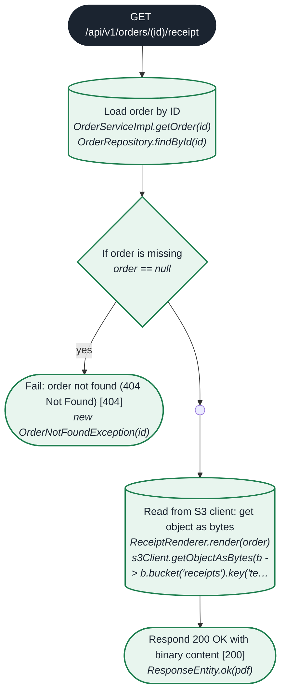

## API change review — apiflow-difftest

`master @5d9c6ac` → `feature/fraud-tuning @981aaf3`  
**Risk: high** · endpoints: +1 added, −1 removed, ~3 modified, 0 unchanged · steps: +6 / −2 / ~2

Fraud review now triggers at **score > 60** (was 80). **Breaking:** `POST /api/v1/orders/{id}/cancel` returns 200 instead of 204.

| | Endpoint | Change | Risk | What changed |
|---|---|---|---|---|
| 🔴 | `GET /api/v1/orders`<br>List orders | removed | high | Endpoint removed — breaking for existing clients |
| 🟠 | `POST /api/v1/orders`<br>Place an order | modified | medium | Feature flags: now gated by order-confirmation-email<br>Condition changed: “If score > 80” → “If score > 60”<br>New condition (feature flag): If feature flag order-confirmation-email is on → Call notification-service: POST /emails/order-confirmation |
| 🔴 | `GET /api/v1/orders/{id}`<br>Fetch a single order | modified | high | Authorization changed: hasRole('ORDER_READ') → hasRole('ORDER_ADMIN') |
| 🔴 | `POST /api/v1/orders/{id}/cancel`<br>Cancel order | modified | high | Status code changed 204 No Content → 200 OK on the main path |
| 🟠 | `GET /api/v1/orders/{id}/receipt`<br>Download the receipt PDF | added | medium | Newly implemented (was only declared in the OpenAPI spec)<br>Performs database access: Load order by ID<br>Performs file/storage access: Read from S3 client: get object as bytes |

<details><summary><b>GET /api/v1/orders</b> — List orders (removed)</summary>

_Endpoint no longer exists in head._

</details>

<details><summary><b>POST /api/v1/orders</b> — Place an order (modified)</summary>

Lower fraud threshold; confirmation email behind a flag.

- 🟠 Feature flags: now gated by order-confirmation-email

- 🟠 Condition changed: “If score > 80” → “If score > 60” _(in Place order › If order total is greater than REVIEW_THRESHOLD)_
- 🟠 New condition (feature flag): If feature flag order-confirmation-email is on → Call notification-service: POST /emails/order-confirmation _(in Place order)_

```diff
  Place order
    If order total is greater than REVIEW_THRESHOLD
-     If score > 80
+     If score > 60
        Save order
        Publish OrderFlaggedEvent to 'order-events' via Kafka
        Return order
+   If feature flag order-confirmation-email is on
+     Call notification-service: POST /emails/order-confirmation
  Respond 201 Created with order DTO [201]
```



</details>

<details><summary><b>GET /api/v1/orders/{id}</b> — Fetch a single order (modified)</summary>

```mermaid
flowchart TD
    n1(["POST /api/v1/orders"])
    n2["Place order<br/><i>OrderServiceImpl.placeOrder(request, requestId)</i>"]
    n3["Validate request<br/><i>OrderServiceImpl.validateRequest(request)</i>"]
    n4{"If request items is missing or request items is empty<br/><i>request.getItems() == null  or  request.getItems().isEmpty()</i>"}
    n5(["Fail: illegal argument (400 Bad Request) — order must contain items [400]<br/><i>new IllegalArgumentException('order must contain items')</i>"])
    n6(( ))
    n7[("Call inventory-service: POST /reservations<br/><i>InventoryClient.reserve(order.getItems())</i>")]
    n8{"If stock is not available<br/><i>!stock.isAvailable()</i>"}
    n9(["Fail: out of stock (409 Conflict) [409]<br/><i>new OutOfStockException(stock.getMissingSkus())</i>"])
    n10(( ))
    n11{"If order total is greater than REVIEW_THRESHOLD<br/><i>order.getTotal().compareTo(REVIEW_THRESHOLD) > 0</i>"}
    n12[("Score the order with the fraud service<br/><i>FraudScorer.score(order)</i><br/><i>restTemplate.postForObject(fraudUrl + '/score', order, Frau…</i>")]
    n13{"If score > 60<br/><i>score > 60</i><br/><i>was: score > 80</i>"}
    n14[("Save order<br/><i>OrderRepository.save(order)</i>")]
    n15[("Publish OrderFlaggedEvent to 'order-events' via Kafka<br/><i>OrderEventPublisher.publish(new OrderFlaggedEvent(order.get…</i><br/><i>kafkaTemplate.send('order-events', event)</i>")]
    n16(["Return order<br/><i>order</i>"])
    n17(( ))
    n18(( ))
    n19["Try, handling payment declined"]
    n20[("Call payment-service: POST /v2/charges<br/><i>PaymentClient.charge(new ChargeRequest(order.getTotal(), re…</i>")]
    n21[("Call inventory-service: DELETE /reservations<br/><i>InventoryClient.release(order.getItems())</i>")]
    n22(["Rethrow payment declined"])
    n23(( ))
    n24[("Save order<br/><i>OrderRepository.save(order)</i>")]
    n25[("Publish OrderPlacedEvent to 'order-events' via Kafka<br/><i>OrderEventPublisher.publish(new OrderPlacedEvent(saved.getI…</i><br/><i>kafkaTemplate.send('order-events', event)</i>")]
    n26{"If feature flag order-confirmation-email is on<br/><i>featureFlags.isEnabled('order-confirmation-email')</i><br/><i>flag: order-confirmation-email</i>"}
    n27[("Call notification-service: POST /emails/order-confirmation<br/><i>NotificationClient.sendConfirmation(saved.getId(), request.…</i>")]
    n28(( ))
    n29(["Respond 201 Created with order DTO [201]<br/><i>orderMapper.toDto(order, true)</i>"])
    n1 --> n2
    n2 --> n3
    n3 --> n4
    n4 -- "yes" --> n5
    n4 --> n6
    n6 --> n7
    n7 --> n8
    n8 -- "yes" --> n9
    n8 --> n10
    n10 --> n11
    n11 -- "yes" --> n12
    n12 --> n13
    n13 -- "yes" --> n14
    n14 --> n15
    n15 --> n16
    n13 --> n17
    n17 --> n18
    n11 --> n18
    n18 --> n19
    n19 -- "Try" --> n20
    n19 -- "On payment declined" --> n21
    n21 --> n22
    n20 --> n23
    n23 --> n24
    n24 --> n25
    n25 --> n26
    n26 -- "yes" --> n27
    n27 --> n28
    n26 --> n28
    n28 --> n29
    classDef cond fill:#F8F6FC,stroke:#7C6F9B,color:#1B2430
    classDef resp fill:#1B2430,stroke:#1B2430,color:#ffffff
    classDef fail fill:#B42318,stroke:#B42318,color:#ffffff
    classDef added fill:#E8F5EE,stroke:#1E7F4F,stroke-width:2px,color:#1B2430
    classDef removed fill:#FCEBEA,stroke:#B42318,stroke-width:2px,stroke-dasharray:4 3,color:#8C3A33
    classDef modified fill:#FFF3E0,stroke:#B25E09,stroke-width:2px,color:#1B2430
    class n1 resp
    class n4 cond
    class n5 fail
    class n8 cond
    class n9 fail
    class n11 cond
    class n13 modified
    class n16 resp
    class n22 fail
    class n26 added
    class n27 added
    class n29 resp
```

- 🔴 Authorization changed: hasRole('ORDER_READ') → hasRole('ORDER_ADMIN')

```diff
  Load order by ID
  If order is missing
  Respond 200 OK with order DTO [200]
```



</details>

<details><summary><b>POST /api/v1/orders/{id}/cancel</b> — Cancel order (modified)</summary>

- 🔴 Status codes: now also 200 OK; no longer 204 No Content

- 🔴 Status code changed 204 No Content → 200 OK on the main path

```diff
  Cancel order
- Respond 204 No Content [204]
+ Respond 200 OK [200]
```



</details>

<details><summary><b>GET /api/v1/orders/{id}/receipt</b> — Download the receipt PDF (added)</summary>

```diff
+ Load order by ID
+ If order is missing
+   Fail: order not found (404 Not Found) [404]
+ Read from S3 client: get object as bytes
+ Respond 200 OK with binary content [200]
```



</details>

